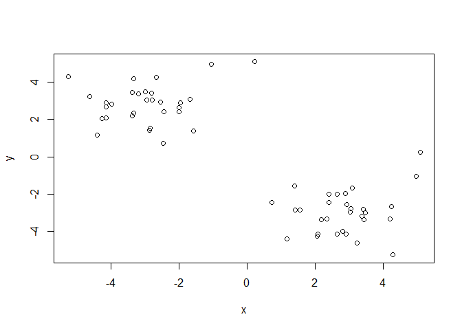
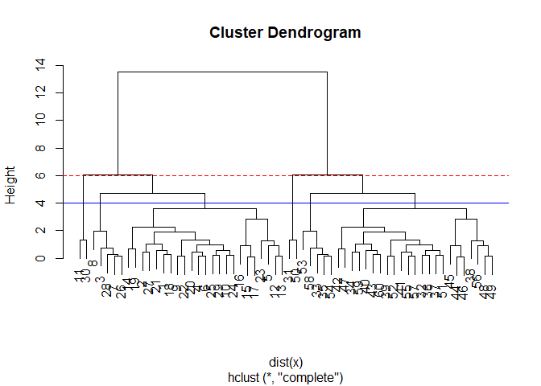
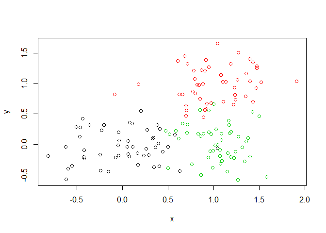

class09.Rmd
================
Kamron Kimball
2/4/2020

# Generate some example data for clustering

``` r
# Generate some example data for clustering
tmp <- c(rnorm(30,-3), rnorm(30,3))
x <- cbind(x=tmp, y=rev(tmp))
plot(x)
```

<!-- -->

``` r
km <- kmeans(x,center=2,nstart=20)
```

Q. How many points are in each cluster? Q. What ‘component’ of your
result object details - cluster size? - cluster assignment/membership? -
cluster center?

``` r
km$cluster
```

    ##  [1] 1 1 1 1 1 1 1 1 1 1 1 1 1 1 1 1 1 1 1 1 1 1 1 1 1 1 1 1 1 1 2 2 2 2 2 2 2 2
    ## [39] 2 2 2 2 2 2 2 2 2 2 2 2 2 2 2 2 2 2 2 2 2 2

``` r
length(km$cluster)
```

    ## [1] 60

``` r
table(km$cluster)
```

    ## 
    ##  1  2 
    ## 30 30

plot x colored by the kmeans cluster assignment and add cluster centers
as blue points

``` r
plot(x,col=km$cluster)
points(km$centers,col="blue")
```

<!-- -->

## Hierarchical clustering in R

The main Hierarchical clustering function in R is caled ‘hclust()’. An
important point is that you have to calculte the distance matrix deom
your input data before calling ‘hclust()’.

``` r
# as the Euclidean distance between observations
dist_matrix <- dist(x)
# The hclust() function returns a hierarchical
# clustering model
hc <- hclust(d = dist_matrix)
# the print method is not so useful here
```

hc Call: hclust(d = dist\_matrix) \#Cluster method : complete Distance :
euclidean \#Number of objects: 60

``` r
#We will use our x again from above
d <- dist(x)
hc <- hclust(d)
plot(hc)
```

<!-- -->

``` r
# Our input is a distance matrix from the dist()
# function. Lets make sure we understand it first
dist_matrix <- dist(x)
dim(dist_matrix)
```

    ## NULL

``` r
NULL
```

    ## NULL

``` r
View( as.matrix(dist_matrix) )
dim(x)
```

    ## [1] 60  2

``` r
#[1] 60 2
dim( as.matrix(dist_matrix) )
```

    ## [1] 60 60

``` r
#[1] 60 60
# Note. symmetrical pairwise distance matrix
```

``` r
# Create hierarchical cluster model: hc
hc <- hclust(dist(x))
# We can plot the results as a dendrogram
plot(hc)
```

<!-- -->

``` r
# What do you notice?
# Does the dendrogram
# make sense based on
# your knowledge of x?
```

``` r
# Draws a dendrogram
plot(hc)
abline(h=6, col="red", lty=2) 
abline(h=4, col="blue")
```

<!-- -->

``` r
cutree(hc, h=6) #Cut by height h
```

    ##  [1] 1 1 1 1 1 1 1 1 1 1 2 1 1 1 1 1 1 1 1 1 1 1 1 1 1 1 1 1 1 2 3 4 4 4 4 4 4 4
    ## [39] 4 4 4 4 4 4 4 4 4 4 4 3 4 4 4 4 4 4 4 4 4 4

To get cluster membership vector i need to “cut” the tree at a certain
height to yield my separate cluster branches.

``` r
cutree(hc, h=4)
```

    ##  [1] 1 1 2 1 1 1 2 2 1 1 3 1 1 1 1 1 1 1 1 1 1 1 1 1 1 2 1 2 1 3 4 5 6 5 6 5 5 5
    ## [39] 5 5 5 5 5 5 5 5 5 5 5 4 5 5 6 6 5 5 5 6 5 5

``` r
gp4 <-  cutree(hc, h=4)
table(gp4)
```

    ## gp4
    ##  1  2  3  4  5  6 
    ## 23  5  2  2 23  5

``` r
# Step 1. Generate some example data for clustering
x <- rbind(
 matrix(rnorm(100, mean=0, sd = 0.3), ncol = 2), # c1
 matrix(rnorm(100, mean = 1, sd = 0.3), ncol = 2), # c2
 matrix(c(rnorm(50, mean = 1, sd = 0.3), # c3
 rnorm(50, mean = 0, sd = 0.3)), ncol = 2))
colnames(x) <- c("x", "y")
# Step 2. Plot the data without clustering
plot(x)
```

<!-- -->

``` r
# Step 3. Generate colors for known clusters
# (just so we can compare to hclust results)
col <- as.factor( rep(c("c1","c2","c3"), each=50) )
plot(x, col=col)
```

<!-- -->

Q. Use the dist(), hclust(), plot() and cutree() functions to return 2
and 3 clusters Q. How does this compare to your known ‘col’ groups?

``` r
z <- dist(x)
v <- hclust(z)

#Use "cutree" to get a cluster membership vector
ct <- cutree(v,h=2)

plot(v, col=ct)
```

<!-- -->

``` r
table(ct)
```

    ## ct
    ##  1  2  3 
    ## 57 36 57

``` r
#Make a plot that is grouped by ct
plot(x, col=ct)
```

<!-- -->

``` r
ukf <- read.csv("Data/UK_foods.csv", row.names=1)
ukf
```

    ##                     England Wales Scotland N.Ireland
    ## Cheese                  105   103      103        66
    ## Carcass_meat            245   227      242       267
    ## Other_meat              685   803      750       586
    ## Fish                    147   160      122        93
    ## Fats_and_oils           193   235      184       209
    ## Sugars                  156   175      147       139
    ## Fresh_potatoes          720   874      566      1033
    ## Fresh_Veg               253   265      171       143
    ## Other_Veg               488   570      418       355
    ## Processed_potatoes      198   203      220       187
    ## Processed_Veg           360   365      337       334
    ## Fresh_fruit            1102  1137      957       674
    ## Cereals                1472  1582     1462      1494
    ## Beverages                57    73       53        47
    ## Soft_drinks            1374  1256     1572      1506
    ## Alcoholic_drinks        375   475      458       135
    ## Confectionery            54    64       62        41

``` r
barplot(as.matrix(ukf), beside=T, col=rainbow(nrow(ukf)))
```

<!-- -->

a “Pairs” plot can be useful when we have small datasets like this one
but often we are

``` r
pairs(ukf, col=rainbow(10), pch=16)
```

<!-- -->

We can use PCA to better visualize this data

Principal Component analysis (PCA) with the “prcomp()” function

``` r
# Use the prcomp() PCA function 
pca <- prcomp( t(ukf) )
summary(pca)
```

    ## Importance of components:
    ##                             PC1      PC2      PC3       PC4
    ## Standard deviation     324.1502 212.7478 73.87622 4.189e-14
    ## Proportion of Variance   0.6744   0.2905  0.03503 0.000e+00
    ## Cumulative Proportion    0.6744   0.9650  1.00000 1.000e+00

What is in my result object “pca”

``` r
attributes(pca)
```

    ## $names
    ## [1] "sdev"     "rotation" "center"   "scale"    "x"       
    ## 
    ## $class
    ## [1] "prcomp"

``` r
plot(pca$x[,1], pca$x[,2], xlab="PC1", ylab="PC2", xlim=c(-270,500))
text(pca$x[,1], pca$x[,2], colnames(ukf), col=rainbow(4))
```

<!-- -->
